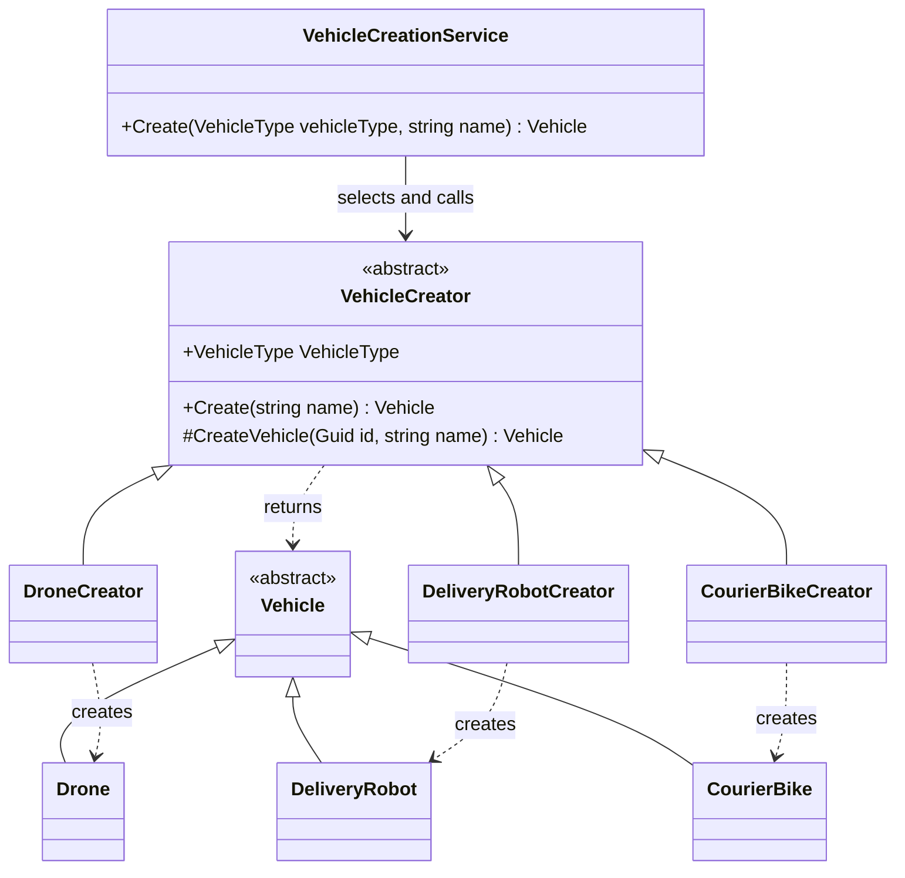

# Factory Method

## Intent

Factory Method defines a creation contract while allowing subclasses to decide which concrete product is instantiated. In C#, an abstract creator can expose a common creation workflow and call a protected abstract method that concrete creators override to construct a product.

The caller works with the creator and product abstractions, while concrete creators own the concrete constructor calls.

## Problem

The first SmartCity implementation put vehicle selection, construction, and default configuration in `VehicleCreationService`. Its switch directly instantiated `Drone`, `DeliveryRobot`, or `CourierBike` and supplied each vehicle's speed and payload limits.

This was a reasonable solution for three vehicle types. As the set grows, however, adding a vehicle requires modifying the service, and changes to concrete constructors or construction rules can also affect it. The service becomes increasingly coupled to concrete vehicle implementations and their configuration.

Factory Method moves those construction decisions into dedicated creators while keeping selection in the service.

## Structure



The inheritance arrows point toward the base classes. The service holds a collection of creators; each concrete creator constructs its corresponding product.

## Participants

| Participant | General responsibility | SmartCity class |
| --- | --- | --- |
| Product | Common product contract used by callers | `Vehicle` |
| Concrete Products | Specific implementations of the product | `Drone`, `DeliveryRobot`, `CourierBike` |
| Creator | Defines the creation workflow and factory method | `VehicleCreator` |
| Concrete Creators | Override the factory method to instantiate concrete products | `DroneCreator`, `DeliveryRobotCreator`, `CourierBikeCreator` |
| Client / coordinating service | Selects a creator and requests a product | `VehicleCreationService` |

## SmartCity Implementation

The products live in `SmartCity.Domain.Vehicles`. The creators and coordinating service live in `SmartCity.Application.Vehicles`.

### VehicleCreator

`VehicleCreator` exposes the abstract `VehicleType` property to identify the type it supports. Its public `Create(string name)` method generates an ID with `Guid.NewGuid()` and passes the ID and name to `CreateVehicle(Guid id, string name)`.

`CreateVehicle` is the protected abstract factory method. Concrete creators override it to decide which concrete `Vehicle` to instantiate. The shared `Create` method returns that product to the caller.

### Concrete creators

Each concrete creator owns the constructor call and the defaults for its product:

| Creator | Product | MaxSpeedKph | MaxPayloadKg |
| --- | --- | --- | --- |
| `DroneCreator` | `Drone` | 80 | 5 |
| `DeliveryRobotCreator` | `DeliveryRobot` | 12 | 50 |
| `CourierBikeCreator` | `CourierBike` | 35 | 25 |

They pass the ID and name supplied by the base workflow to the product constructor. Validation of the ID, name, speed, and payload remains in the `Vehicle` constructor.

### VehicleCreationService

`VehicleCreationService` accepts an `IEnumerable<VehicleCreator>` and builds a dictionary keyed by each creator's `VehicleType`. Its `Create` method looks up the requested type with `TryGetValue` and calls the selected creator's `Create(name)`. It no longer directly constructs `Drone`, `DeliveryRobot`, or `CourierBike`.

If the type is absent from the registry, the service throws `ArgumentOutOfRangeException`, with `vehicleType` as the parameter name and the requested value as `ActualValue`. This preserves the behavior for `(VehicleType)999` and also covers a known type whose creator was not supplied. The collection must contain at most one creator per type because `ToDictionary` rejects duplicate keys.

The parameterless constructor still creates the standard set of `DroneCreator`, `DeliveryRobotCreator`, and `CourierBikeCreator` directly. This is an acceptable simplification at this educational stage. That wiring can later move to the application composition root, where dependencies are assembled, or to dependency injection registration without changing Factory Method itself. There is currently no DI registration for these creators.

Existing service tests protect the concrete products, generated non-empty IDs, names, default speeds and payloads, and unsupported-type behavior. Additional tests show that a supplied creator can change construction configuration and that a missing registration is rejected.

## Before

Commit `e60bfa0` (`feat: add vehicle creation`) implemented selection and construction together. This simplified excerpt omits constructor arguments and exception details:

```csharp
return vehicleType switch
{
    VehicleType.Drone => new Drone(...),
    VehicleType.DeliveryRobot => new DeliveryRobot(...),
    VehicleType.CourierBike => new CourierBike(...),
    _ => throw new ArgumentOutOfRangeException(...)
};
```

`VehicleCreationService` both selected the product and constructed/configured it. Each branch generated an ID and passed the name and type-specific defaults to a concrete constructor.

## After

Commit `ff56164` (`refactor: apply Factory Method to vehicle creation`) introduced the creator hierarchy. The following excerpts omit using directives and namespaces:

```csharp
public abstract class VehicleCreator
{
    public abstract VehicleType VehicleType { get; }

    public Vehicle Create(string name)
        => CreateVehicle(Guid.NewGuid(), name);

    protected abstract Vehicle CreateVehicle(Guid id, string name);
}

public sealed class DroneCreator : VehicleCreator
{
    public override VehicleType VehicleType => VehicleType.Drone;

    protected override Vehicle CreateVehicle(Guid id, string name)
        => new Drone(id, name, maxSpeedKph: 80m, maxPayloadKg: 5m);
}
```

The service retains selection and error handling, then delegates through `VehicleCreator`:

```csharp
if (!_creators.TryGetValue(vehicleType, out var creator))
{
    throw new ArgumentOutOfRangeException(
        nameof(vehicleType),
        vehicleType,
        "The requested vehicle type is not supported.");
}

return creator.Create(name);
```

For a drone request, the call proceeds from the service to `VehicleCreator.Create`, then to `DroneCreator.CreateVehicle`, which constructs the `Drone`. The refactoring preserves the original observable creation behavior.

## Why This Pattern

Factory Method moves concrete construction logic out of `VehicleCreationService`. The creation path depends on the creator abstraction instead of concrete vehicle constructors. Construction rules stay together in the creator dedicated to each concrete vehicle type.

Adding a new product and creator does not require another direct vehicle `new` expression in the service. It does require a supported `VehicleType` value and registration of the creator. The existing dictionary lookup can remain unchanged. If the parameterless constructor should include the new creator, its default collection must still be updated; the current service is therefore not completely closed to all changes.

Supplying a different creator for an existing type can customize construction behavior. For example, `VehicleCreationServiceTests` supplies `CustomDroneCreator` to return a drone with different speed and payload values. It derives from `VehicleCreator` because the standard concrete creators are sealed.

This improves extensibility at the cost of more classes and an additional step between the service call and the product constructor.

## Trade-offs

Advantages:

- Reduces the service's coupling to concrete products and their constructors.
- Isolates construction logic and defaults in a creator for each product.
- Makes extending creation behavior easier without changing the lookup workflow.
- Allows creation behavior to be substituted in tests or different configurations.
- Follows the Open/Closed Principle more closely for the creation workflow, while registration and the enum can still require changes.

Disadvantages:

- Adds a base creator and a concrete creator class for each product.
- Introduces indirection when following a creation request through the code.
- Can be excessive when construction is simple and stable.
- Leaves creator selection and registration to a coordinator or composition root.

Factory Method does not eliminate conditional logic universally. SmartCity replaces its product-construction switch with a dictionary lookup and still branches when a creator is missing.

## When Not to Use

Factory Method may be unnecessary when only one concrete type exists, construction is trivial and unlikely to change, or a constructor call or short switch expresses the requirements more clearly. If there are no meaningful variations in construction to isolate, multiple creator classes can add more complexity than value.

The original SmartCity switch remains a reasonable choice for a small, stable set of vehicle types. The refactoring demonstrates how the structure can evolve when creation rules need separate ownership and substitution.

## Interview Notes

| Question | Key points |
| --- | --- |
| What problem does Factory Method solve? | It separates a shared creation contract/workflow from concrete product construction, allowing subclasses to choose the product. |
| How is Factory Method different from a Simple Factory? | A Simple Factory typically centralizes product selection and construction in one method, often using a switch. GoF Factory Method delegates construction to an overridable method on a creator hierarchy. The original service resembled a Simple Factory. |
| How is Factory Method different from Abstract Factory? | Factory Method focuses on an overridable creation method. Abstract Factory provides a contract for creating families of related products; its implementations can themselves use factory methods. SmartCity demonstrates individual vehicle creation, not product families. |
| Why does Factory Method usually rely on inheritance? | Concrete creators inherit the creator contract and override the factory method. Calls from the base workflow dispatch to the concrete override. |
| Where is the factory method in SmartCity? | `VehicleCreator.CreateVehicle(Guid id, string name)` and its overrides. Public `Create(string name)` is the shared workflow that calls it. |
| Who decides which creator is used? | The service caller requests a `VehicleType`; `VehicleCreationService` selects the corresponding registered creator. The constructor caller supplies registrations, or the parameterless constructor supplies the standard set. |
| Does Factory Method remove all switches? | No. Creator selection must still happen somewhere and can use a switch, registry, or another mechanism. This implementation uses a dictionary and a missing-creator check. |
| When would DI replace part of the current creator selection? | When application wiring needs central configuration, DI could supply the creator collection and replace the parameterless constructor's manual assembly. Supplying a collection alone would not replace the service's per-request lookup by `VehicleType`. No such DI setup exists here yet. |
| Why is VehicleCreationService not itself the Factory Method? | It is a sealed coordinator that selects and calls creators. It has no overridable construction method; the Factory Method extension point belongs to `VehicleCreator` and its subclasses. |
